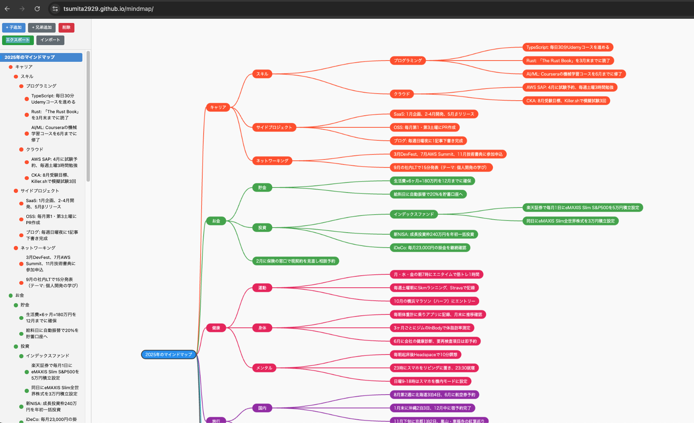

# Mindmap Editor

ブラウザで動作するシンプルなマインドマップエディタです。  
マインドマップを作成したらローカルにデータをエクスポートして保管してください。



## 機能

- マインドマップの作成・編集
- ノードの追加（子ノード・兄弟ノード）
- ノードの色変更
- ドラッグによるキャンバス移動
- ズームイン・ズームアウト
- JSON形式でのエクスポート・インポート
- ローカルストレージへの自動保存
- Undo/Redo対応
- 日本語入力（IME）対応

## 使い方

`index.html` をブラウザで開くだけで使用できます。

### キーボードショートカット

| キー | 動作 |
|------|------|
| Enter | 子ノードを追加 |
| Tab | 兄弟ノードを追加 |
| F2 / Space | ノード名を編集 |
| Backspace | 新規ノードを削除 |
| Escape | 選択解除 / 編集キャンセル |
| Ctrl+Z / Cmd+Z | 元に戻す |
| Ctrl+Y / Cmd+Shift+Z | やり直し |

### マウス操作

- クリック: ノード選択
- ダブルクリック: ノード名を編集
- 右クリック: コンテキストメニュー
- ドラッグ: キャンバス移動
- ホイール: ズーム

## エクスポート・インポート

### エクスポート

ツールバーの「エクスポート」ボタンをクリックすると、現在のマインドマップをJSON形式でダウンロードできます。ファイル名は `mindmap.json` として保存されます。

### インポート

ツールバーの「インポート」ボタンをクリックし、JSONファイルを選択すると読み込めます。

### データ形式

エクスポートされるJSONの構造:

```json
{
  "id": 1,
  "label": "ルートノード",
  "color": "#4a90d9",
  "children": [
    {
      "id": 2,
      "label": "子ノード",
      "color": "#e91e63",
      "children": []
    }
  ]
}
```

## サンプルデータ

`sample_data/` フォルダにサンプルのマインドマップデータが含まれています。

- `mindmap-2025.json` - 2025年の目標マインドマップ（日本語）

インポート機能を使ってこれらのファイルを読み込むことができます。

## ファイル構成

```
├── index.html          # メインアプリケーション
├── favicon.svg         # ファビコン
└── sample_data/
    ├── mindmap-2025.json   # サンプルデータ（日本語）
    └── sample.png          # サンプル画像
```

## ライセンス

MIT License
